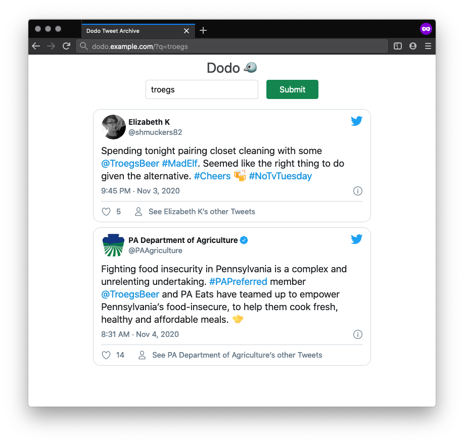

# Dodo

Synchronize your Twitter timeline to a local database for archival and search.



Available as a binary and Docker container.


## Usage

Dodo consumes data from Twitter and requires you register your own Twitter application for keys:
https://developer.twitter.com/en/apply-for-access

You will need an OAuth access token and access secret as well as an API key and secret.

From there, you can run Dodo in one of two ways:

 * [Command line](#command-line)
 * [Docker](#docker)

### Command-line

Install on Mac OS with:
```
$ brew install JakeWharton/repo/dodo
```

For other platforms, download ZIP from
[latest release](https://github.com/JakeWharton/dodo/releases/latest)
and run `bin/dodo` or `bin/dodo.bat`.

Dodo can run in two modes:
 - One-off syncs via `sync` subcommand, or
 - Long-running web-server with manual syncs

```
$ dodo --help
Usage: dodo [OPTIONS] COMMAND [ARGS]...

Options:
  -h, --help  Show this message and exit

Commands:
  sync  Perform a one-time sync of the latest tweets
  run   Start an HTTP server for displaying tweets and performing syncs
```

The `sync` subcommand will perform a one-off sync to the specified Sqlite database file.
You can run it on a cron and use `sqlite3` or any Sqlite-capable tool to consume the data.

```
$ dodo sync --help
Usage: dodo sync [OPTIONS]

  Perform a one-time sync of the latest tweets

Options:
  --db FILE            Sqlite database file
  --access-token KEY   OAuth access token
  --access-secret KEY  OAuth access token secret
  --api-key KEY        OAuth consumer API key
  --api-secret KEY     OAuth consumer API secret
  -h, --help           Show this message and exit
```

The `run` subcommand will start a webserver with a search and manual sync interface. You can also
POST the `/sync` endpoint to trigger a sync, such as on a cron.

```
$ dodo run --help
Usage: dodo run [OPTIONS]

  Start an HTTP server for displaying tweets and performing syncs

Options:
  --db FILE            Sqlite database file
  --access-token KEY   OAuth access token
  --access-secret KEY  OAuth access token secret
  --api-key KEY        OAuth consumer API key
  --api-secret KEY     OAuth consumer API secret
  --port PORT          Port for the HTTP server (default 8098)
  -h, --help           Show this message and exit
```

## Docker

The container starts the webserver on port 8098 and automatically triggers sync using cron.

[][hub]
[][layers]

 [hub]: https://hub.docker.com/r/jakewharton/dodo/
 [layers]: https://microbadger.com/images/jakewharton/dodo

```
$ docker run -it --rm
    -v /path/to/data:/data \
    -e "CRON=*/3 * * * *" \
    -e "ACCESS_TOKEN=..." \
    -e "ACCESS_SECRET=..." \
    -e "API_KEY=..." \
    -e "API_SECRET=..." \
    jakewharton/dodo:trunk
```

To be notified when sync is failing visit https://healthchecks.io, create a check, and specify
the ID to the container using the `HEALTHCHECK_ID` environment variable.

### Docker Compose

```yaml
version: '2'
services:
  dodo:
    image: jakewharton/dodo:trunk
    restart: unless-stopped
    volumes:
      - /path/to/data:/data
    environment:
      - "CRON=*/3 * * * *"
      - "ACCESS_TOKEN=..."
      - "ACCESS_SECRET=..."
      - "API_KEY=..."
      - "API_SECRET=..."
      #Optional:
      - "HEALTHCHECK_ID=..."
      - "PUID=..."
      - "PGID=..."
```


## Development

To run the latest code build with `./gradlew installDist`.  This will put the application into
`build/install/dodo/`. From there you can use the [command-line instructions](#command-line)
instructions to run.

The Docker containers can be built with `docker build .`, which also runs the full set of checks
as CI would.


# License

    Copyright 2020 Jake Wharton

    Licensed under the Apache License, Version 2.0 (the "License");
    you may not use this file except in compliance with the License.
    You may obtain a copy of the License at

       http://www.apache.org/licenses/LICENSE-2.0

    Unless required by applicable law or agreed to in writing, software
    distributed under the License is distributed on an "AS IS" BASIS,
    WITHOUT WARRANTIES OR CONDITIONS OF ANY KIND, either express or implied.
    See the License for the specific language governing permissions and
    limitations under the License.
